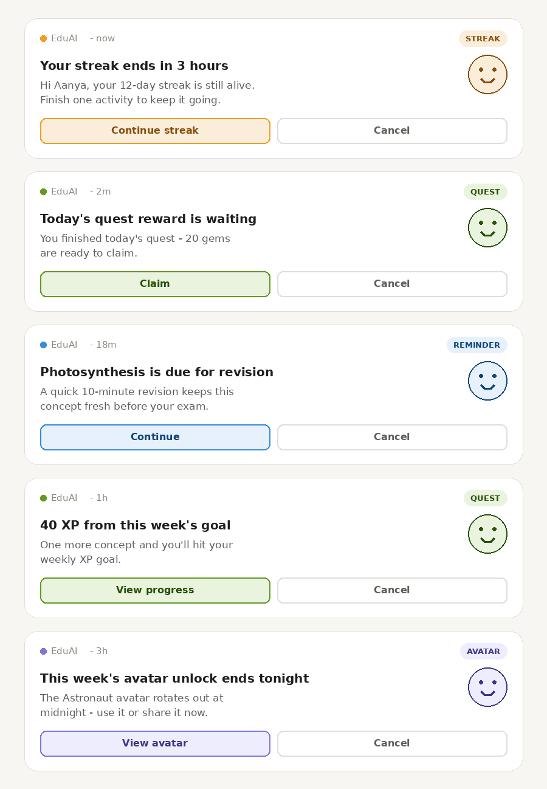

# Notification Use Cases — EduAI Gamification

Builds on two existing sources of truth:
- `Notification/` R&D (`final_notification_feature_plan.pdf`, `nactivity_notification_flow.pdf`) — the local-first Room + AlarmManager architecture and 4 notification types already speced (Inactivity, Streak Praise, Custom Reminder, Chapter Progress).
- `INTEGRATION_PLAN_PART2.md` §4/§15/§17 — push notifications flagged as the single biggest retention lever, deferred to Phase 2, with kids-app compliance constraints (Play Families policy, no manipulative nudging, contextual `POST_NOTIFICATIONS` request).

This doc extends the existing 4 types with the gamification-specific use cases (streaks, leagues, quests, XP, friends, avatars) that come from the gamified core in `phase0-native/` (`GamificationEvent.kt`, leagues, quests) and haven't been scoped yet. It also splits everything by **where the logic can live** — local device (Room/AlarmManager, ship anytime) vs. server-triggered (FCM/Cloud Functions, needs Phase 2 infra) — since that's the main blocker.

## 1. Already speced (Notification/ folder — no change needed)

| Type | Trigger | Source |
|---|---|---|
| Inactivity | 5/10/15+ days since last session | `SessionEntity`, local AlarmManager |
| Streak Praise | Streak hits milestone (5, 10, 15…) | `StreakEntity`, local |
| Custom Reminder | User-set daily time | `ReminderPreferences` (DataStore), local |
| Chapter Progress | Chapter left in-progress | `ChapterAgentProgressEntity`, local |

## 2. New use cases — local-only (extend the existing AlarmManager/Room pattern, no Phase 2 infra needed)

| Use case | Trigger | Why it's different from what exists |
|---|---|---|
| **Streak-at-risk-today** | It's evening, today's streak isn't logged yet, current streak > 0 | Loss-framed and time-sensitive — highest-leverage single notification per most gamified apps, but *not* the same as Streak Praise (which fires on success). Needs careful, non-alarming copy for a kids' app. |
| **Streak freeze available/used** | A freeze token is about to expire unused, or was just auto-consumed | Informational, not manipulative — tells the user *why* their streak survived a missed day. |
| **Quest expiring today** | A daily quest (from the exam planner) is unclaimed and resets at midnight | Distinct from Chapter Progress — quests are gamification-layer, not raw learning content. |
| **Quest reward unclaimed** | `QuestCompleted` fired but the reward screen was never opened | Recovers "phantom completions" where the user did the work but didn't see the payoff. |
| **Weekly XP goal close** | User is within ~10–15% of a self-set or default weekly XP target, day is Thu/Fri/Sat | Nudges the loop the app already tracks (`XpScope.WEEKLY`) without needing server data. |
| **Avatar unlock expiring** | A rewarded-ad-unlocked weekly avatar rotates out in <24h and hasn't been used/shared | Ties into the existing Avatar Studio retention loop (P0-H10). |

## 3. Personalizing local-only notifications (no Cloud Functions needed)

Every input below already exists on-device — no new data collection, no server round-trip. Per the spec's own design principle (§1): *"personalization comes from rules over the student's own data... deterministic and explainable"* — not LLM-generated text. That constraint is convenient here: template-filled strings are free to run, predictable for Play Families review, and don't need a content-safety pass.

| Personalization lever | Local data source | Example |
|---|---|---|
| **Name the exact due item, not a generic nudge** | Leitner revision queue (spec §2, driven by quiz scores) + `ChapterAgentProgressEntity` | "Photosynthesis is due for revision today" instead of "Come back and learn!" |
| **Exam countdown, when relevant** | Exam Prep Planner's stored exam type/date | "3 days to your Science exam — today's agenda: 2 revision items" — only fires if a plan exists, silent otherwise |
| **Effort framing, never accuracy** | `StreakEntity`, `XpEarned` events, minutes studied | "You've studied 4 days in a row" — *not* "you scored 60%," per spec §1's reward-effort-not-accuracy rule |
| **Voice it as the student's own tutor** | Saved `TutorConfig` (Free/Orb avatar, persisted via P0-H9) | Notification sender name/icon matches their chosen avatar instead of a generic app icon — reuses state that's already persisted locally |
| **Send-time personalization** | `SessionEntity` history (session start timestamps) | Compute each student's most common active hour from their own last N sessions; schedule the local AlarmManager trigger ~30–60 min before that hour instead of a fixed 8 PM for everyone |
| **Greeting** | First name (spec §1: "avatar + first name only") | "Hi Aanya —" prefix on templates; no other PII needed or allowed |
| **Priority selection among eligible messages** | All of the above, compared same-day | If exam is <3 days out, exam-countdown copy wins over generic streak copy that day — simple local rule, not randomness |
| **Locale** | Device locale | String-resource templates in Hindi/regional languages (already flagged as a gap in §15.8) — same trigger logic, localized copy |
| **Silence, not filler** | Absence of data | If there's no due revision item / no active exam plan / quest already claimed, skip that category rather than sending a generic filler notification |

This keeps the existing "pick a random text from a list" approach from `final_notification_feature_plan.pdf` but adds a slot-filling layer on top — same architecture, same `NotificationStateEntity` write-back, just smarter template selection and variable substitution at build time.

## 4. New use cases — server-triggered (needs FCM + Cloud Functions, Phase 2 per §16)

These depend on state the device doesn't own alone (other users, global timers) — this is *why* they're gated behind the Phase 2 FCM buildout, not an oversight.

| Use case | Trigger | Depends on |
|---|---|---|
| **League ending soon** | "League ends in 2h" — explicitly called out in §4/§16 | Weekly rollover Cloud Function, server clock |
| **League promotion/demotion** | Weekly cohort rollover moves the user's rank tier | Server-computed standings |
| **Overtaken in league** | Another player's XP passes the user's rank within the same cohort | Real-time or near-real-time cohort standings |
| **Friend milestone** | A friend (Path A, add-by-code) hits a streak or league milestone | `friends/` graph, server fan-out |
| **Friend cheered you** | Someone 👍-cheers the user's activity-feed entry | Friends feed write |
| **Referral reward granted** | Invitee's first concept completion grants +50 gems to both (Path B) | Install attribution — blocked on FDL replacement per §15.1, so this notification is naturally Phase 2+ |
| **New league season / cohort assigned** | Monday rollover assigns the user to a new weekly cohort | Server cohort assignment |

**Play Console note on the two friend-related rows:** "Friend milestone" and "Friend cheered you" both notify about a **Social Feature** under Google Play's Families Policy Requirements. That policy requires (1) an in-app reminder about online safety shown before a child user can exchange freeform media/info, and (2) **adult action** (PIN, birthdate, etc.) before a child can exchange personal information with another user. The notification itself is fine — it's the underlying friends feature it points to that needs the safety reminder + adult-action gate already scoped for Path A friending. Nothing in the notification copy should encourage bypassing that gate.

## 5. Notification data structure (generalizing beyond the original 4 types)

`final_notification_feature_plan.pdf`'s `NotificationStateEntity` is one flat row per user with a hardcoded boolean per type (`inactivityNotifShown`, `chapterInProgressId`, …). That works for 4 types but doesn't scale to the ~10 more in §2/§3 — every new type would mean another column + migration. Recommend generalizing before adding them:

| Concept | Today (original plan) | Recommended for the expanded set |
|---|---|---|
| State storage | Flat per-type booleans on one `NotificationStateEntity` row | Keep that entity for the original 4 (already built); add a generic `NotificationLogEntity(userId, type: NotificationType, lastShownDate, dedupKey)` — one row per fired notification, not one column per type |
| Type identity | Implicit (which boolean got checked) | Explicit `NotificationType` enum — one entry per use case across §1–§3, reused for firing logic *and* settings toggles |
| Channel/category | Not modeled | `NotificationCategory` enum (`STREAKS`, `QUESTS`, `LEAGUES_SOCIAL`, `REMINDERS`) — each `NotificationType` maps to exactly one category; this is also the Android `NotificationChannel` boundary |
| Content | Hardcoded text list per type | `NotificationContent(titleTemplate, bodyTemplate, slotValues)` — same random-pick-from-list approach from the original plan, with the §3 slot-filling layer on top |
| Deep link | One hardcoded extra: `intent.putExtra("navigateToChapterId", id)` | Generalize to `NotificationDeepLink(route: String, params: Map<String,String>)` — e.g. `route="chapter"`, `route="quest"`, `route="avatarStudio"`. `MainActivity`/`NavController` reads the same extras pattern, just not chapter-specific anymore |
| Actions | Two fixed pairs ("Go to App"/"Cancel", "Continue"/"Cancel") | Keep the two-button pattern; generalize the primary label per type (`"Continue"`, `"Claim"`, `"View League"`) |
| Priority | Not modeled | Map each `NotificationType` to `NotificationCompat.PRIORITY_*`/channel importance — e.g. streak-at-risk = high (time-sensitive), weekly-XP-close = default |
| Frequency capping | Not modeled | New `NotificationBudgetEntity(userId, date, sentCount, lastSentAt)` — one row per user per day, checked before every send |

**Frequency cap — locked in:** max **3 notifications/day**, minimum **2-hour gap** between any two, enforced app-wide (across all categories, not per-category). This is a hard rule, not a suggestion the priority ranking can override.

- **Daily reset:** `sentCount` resets to 0 at local midnight (same boundary the streak/quest day-rollover already uses).
- **Evaluation pass, updated:** at each scheduled check (AlarmManager tick or event-triggered), gather all *eligible* types → drop any that would fire before `lastSentAt + 2h` → drop everything if `sentCount >= 3` for the day → rank what's left by priority (§3's rule, e.g. exam countdown beats generic streak copy) → fire the top one → increment `sentCount`, update `lastSentAt`.
- **This closes the original plan's gap** (Custom Reminder fires "independent of Room state," so it could previously stack with Inactivity/Streak Praise/Chapter Progress on the same evening) and covers all the new §2 types the same way, with one shared budget check instead of per-type logic.
- **Forward-looking:** once Phase 2's server-triggered types (§4) ship, they should draw from the same daily budget rather than a separate one — otherwise a student could still get 3 local + N server notifications in a day. Worth revisiting the budget check as server-side logic (or a client-side merge) when that lands, not scoped further here since it's Phase 2.

## 6. Settings screen structure

`NotificationSettingsScreen.kt`/`ViewModel.kt` already exist in the original plan, scoped to the custom reminder time picker. Extending that same screen to cover the full set:

| Setting | Storage | Behavior |
|---|---|---|
| **Master toggle** | New `DataStore` key `notificationsEnabled` | Mirrors the OS `POST_NOTIFICATIONS` state on Android 13+; if the OS permission is denied, show "Enable in system settings" linking to `Settings.ACTION_APP_NOTIFICATION_SETTINGS` rather than re-prompting in-app |
| **Per-category toggles** | One `DataStore` bool per `NotificationCategory` (`streaksEnabled`, `questsEnabled`, `remindersEnabled`; `leaguesSocialEnabled` added in Phase 2) | Checked before the evaluation pass fires anything in that category; also deep-links to the matching Android notification channel for OS-level control, since an app can't force-enable a channel the user muted at the system level |
| **Custom reminder time** | Existing `ReminderPreferences` (hour/minute) | No change — stays under the Reminders category |
| **Quiet hours** *(optional)* | New `DataStore` keys `quietHoursStart`/`quietHoursEnd` | Simple local rule: suppress firing inside the window — still deterministic, no server needed |
| **Locale** | Not a toggle | Inherits device locale automatically once templates are localized (§3) |

Deliberately left out: a per-message frequency slider or "notification tone" picker — not worth the settings complexity for a Class 7 audience, and keeps the screen easy for a parent to skim if they check it.

## 7. Notification presentation spec: icon, text budget, buttons

*(Mockups above use a placeholder avatar face — swap for the actual rendered `TutorConfig` bitmap once the render-to-bitmap path exists.)*

Decisions locked in:

- **Large icon = personalized tutor avatar.** Render the student's saved `TutorConfig` (Free/Orb, already persisted per P0-H9) to a static bitmap for the notification's large icon, instead of a generic category icon. This is a one-time render per notification (not the live animation loop), so it's cheap even on low-end devices — doesn't touch the perf concerns flagged in `INTEGRATION_PLAN_PART2.md` §15.9. **New engineering needed:** a render-to-bitmap path in the avatar pipeline (`EduTutorAvatar` currently renders live Compose, not a static image). **Fallback required** — if no avatar is configured yet (new user, pre-onboarding) or the render fails, fall back to the category icon below.
- **Two buttons everywhere** (primary action + "Cancel"), matching the 4 already-built types — consistency across all notification types, no special-casing lower-stakes ones. Android supports up to 3 action buttons; 2 stays well within that and is what's already shipped.

| Category | Fallback icon (if no avatar) | Small-icon tint | Types |
|---|---|---|---|
| Streaks | `ic_fire` | `warning` (EduAiColors) | Streak Praise, Streak-at-risk, Streak freeze |
| Quests | `ic_trophy` | `success` | Quest expiring, Quest reward unclaimed, Weekly XP goal close |
| Reminders | `ic_book` | `accent` | Inactivity, Custom Reminder, Chapter Progress, Revision due, Exam countdown |
| Leagues & Social *(Phase 2)* | `ic_graph` | `accent` | League ending/promotion, friend activity |
| Avatar | *(new asset needed — none exists yet)* | `pro` | Avatar unlock expiring |

- **Small icon (status bar):** one consistent monochrome/silhouette glyph for the whole app — Android requires this to be alpha-only (no color, no gradient), and it's rendered too small to usefully vary by category anyway. **New asset needed:** none of the existing drawables (`logo.png`, `ic_launcher_foreground.xml`) are already monochrome-silhouette; this needs a dedicated `ic_notification_small.xml`.
- **Title:** budget to ≈40 characters so it doesn't truncate on common device widths — no custom font size; Android renders titles at the system's fixed style, not something we control per-notification.
- **Body:** write to ≈40–50 characters for the collapsed (1-line) view, but always wrap in `NotificationCompat.BigTextStyle` so a swipe-down reveals the full text (up to ~150 characters) for the longer templates — e.g. an exam-countdown notification listing multiple agenda items. Same rule as title: no custom text size or custom `RemoteViews` layout — standard `BigTextStyle` keeps rendering consistent across OEM skins (Samsung/Xiaomi/etc. all reskin notifications differently; custom layouts break more often than they help).
- **Buttons — primary label per type:**

| Type | Primary button | Secondary |
|---|---|---|
| Inactivity | "Go to App" | Cancel |
| Streak Praise | "View Streak" | Cancel |
| Custom Reminder | "Start Now" | Cancel |
| Chapter Progress | "Continue" | Cancel |
| Streak-at-risk | "Continue Streak" | Cancel |
| Streak freeze | "View Streak" | Cancel |
| Quest expiring | "View Quest" | Cancel |
| Quest reward unclaimed | "Claim" | Cancel |
| Weekly XP goal close | "View Progress" | Cancel |
| Avatar unlock expiring | "View Avatar" | Cancel |
| *(Phase 2)* League/friend types | "View League" / "View Friends" | Cancel |

## 8. Explicitly out of scope / use with caution

- **"Come back, you're falling behind"-style comparative nudges** — risk of manipulative framing under Play Families policy; if used, keep copy factual ("Your league ends in 2h") not competitive-pressure ("You're losing!").
- **Parent-facing weekly summary** — a separate, lower-risk channel worth considering later: a digest notification *to the parent's device/email* rather than the child's, sidesteps most of the "nudging kids" concern while still driving re-engagement. Not scoped here since it depends on whether a parent account/view exists yet.
- **Streak-loss ("you broke your streak")** — informational only, no shame framing; low priority since it doesn't drive a positive action.

## 9. Play Console policy constraints

Beyond the "no manipulative nudging" principle already in the plan, four specific Play Console policies bind this feature (verified against current Play Console Help, July 2026):

- **No full-screen intent for notifications.** Play's Device and Network Abuse policy explicitly prohibits apps that "use the full-screen intent permission to force user interaction with disruptive ads or notifications." All types here must ship as standard/heads-up notifications — never `USE_FULL_SCREEN_INTENT`, regardless of how urgent (e.g. streak-at-risk) the copy is.
- **Notifications must pertain to app functionality, not ad delivery.** Play doesn't allow ads or ad links placed in the notification tray — every type in this doc ties to a real gamification event, which already satisfies this; just don't let a future ad-network SDK piggyback a promotional notification through the same channel.
- **Families data-practices rules apply to any SDK in the notification pipeline.** Since the app's target audience includes children, any SDK touching notifications or their backing data (FCM, Firestore sync, analytics/crash reporting) must not transmit AAID, IMEI, MAC/SSID, or precise location from child users, and must not request the `AD_ID` permission for a solely-child-targeted app on API 33+. This is the same constraint the plan already has for GA4 (§14 checklist) — it now also covers the notification data path specifically.
- **APIs/SDKs used for notifications must be approved for child-directed use.** Worth a one-time check that FCM and whatever crash/analytics SDK rides along are covered under Google's child-directed terms (they generally are, but it's a documented requirement, not an assumption) — same category of check as the Families Self-Certified Ads SDK requirement already noted for ad-funded unlocks.

None of this changes the notification *use cases* — it constrains implementation choices (notification style, SDK selection, data flags) that engineering needs to get right regardless of which types ship first.

## 10. Cross-cutting: how these should ship

- **Notification channels (Android):** split into at least `streaks`, `quests`, `leagues_social`, `reminders` channels (§5, §6) so users (or parents) can mute categories independently — also makes the Play Families "no manipulative nudging" review story cleaner.
- **Permission timing:** per §17, request `POST_NOTIFICATIONS` contextually — best moment is right after the *first* local-only win ships (e.g., first streak day or first quest completion), not at cold launch.
- **Event hook-up:** every local-only use case above can key off the existing `GamificationEvent` sealed interface (`XpEarned`, `StreakDayCompleted`, `QuestCompleted`, `BadgeEarned`) already defined in `phase0-native/ui-kit/.../events/GamificationEvent.kt` — the event bus is a natural place to also write into the new `NotificationLogEntity` (§5) so the nightly AlarmManager check has fresh state without new plumbing.
- **New assets needed before build:** monochrome small icon (§7), and the avatar-render-to-bitmap path for the large icon (§7).
- **Sequencing recommendation:** ship the local-only set (§2) alongside or right after the 4 already-speced types — same architecture, same PR. The personalization layer (§3) and the generalized data/settings/presentation structure (§5–§7) are additions on top, not a separate build. Hold the server-triggered set (§4) for the Phase 2 FCM buildout already on the roadmap.
